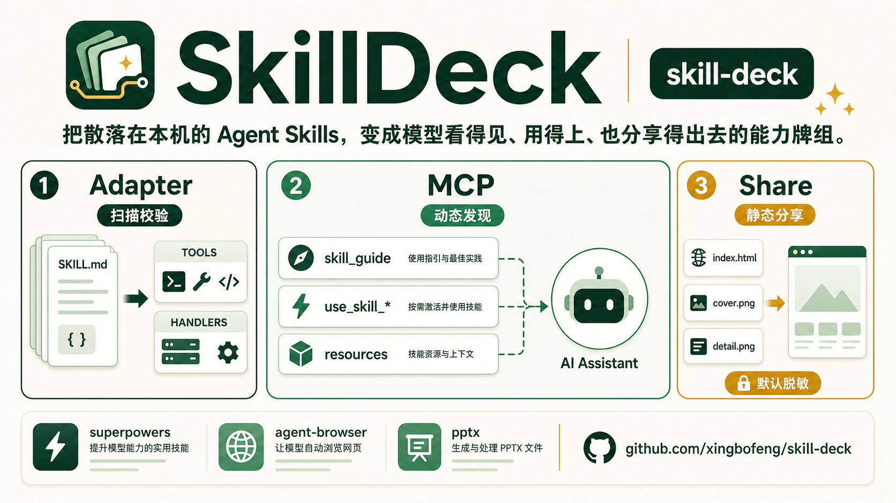
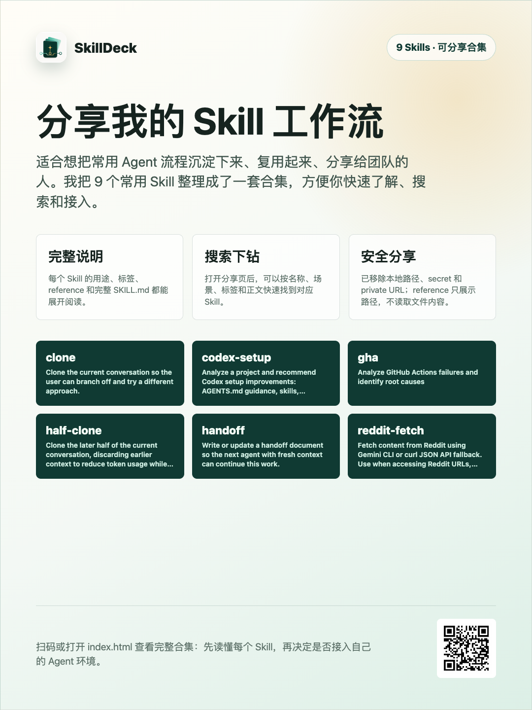
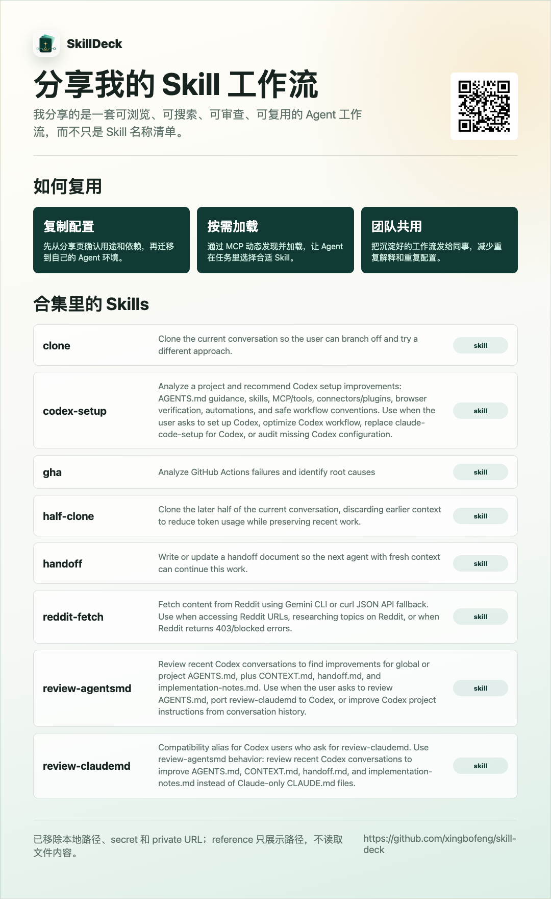

# SkillDeck

<p align="center">
  
</p>

<p align="center">
  <a href="README.md">中文</a> ·
  <a href="README_EN.md">English</a> ·
  <a href="https://skill.counterxing.top">官网</a> ·
  <a href="packages/docs/quickstart.zh.md">快速开始</a> ·
  <a href="https://github.com/xingbofeng/skill-deck">GitHub</a>
</p>

<p align="center">
  <strong>把散落在本机的 Agent Skills，变成模型看得见、用得上、也分享得出去的能力牌组。</strong><br/>
  Adapter for runtimes, MCP dynamic discovery, and share artifacts generated through agent conversation.
</p>

<p align="center">
  
  
  
  
  
  
  
  
</p>

<p align="center">
  
</p>

**SkillDeck** 是本地 Agent Skill 的适配、激活与分享工具。

它解决三个很具体的场景：

| 场景 | 为什么需要它 | SkillDeck 做什么 |
| --- | --- | --- |
| 我有一组 Skill，想通过工具的方式接入 OpenAI Agent SDK。 | OpenAI 已把 `SKILL.md` 定义成可复用工作流，Agents SDK 也支持 local skills，但手写 schema、handler 和 stable id 很繁琐。 | **Adapter** 扫描、解析、校验 `SKILL.md`，生成 provider-neutral tools 和 runtime handlers，让同一套 Skills 可以接入不同 Agent runtime。 |
| 我有一组 Skill，想接到 Claude Code、Cursor 或其他 MCP host。 | 只给 `list_skills` / `read_skill` 不够，模型不一定知道复杂任务要先查本地 Skills。 | **MCP + Skill Activation** 把 Skills 暴露成 tools/resources，并通过 `compact` / `guided` / `active` 三种模式，让模型在任务里自己发现、搜索和加载 Skill。 |
| 我有一组 Skill，想发给同事、同行或社交平台看。 | 私有 Skill 往往含本地路径、secret、私有 URL；只发截图又无法搜索、下钻和复用。 | **Share** 通过 MCP 让 agent 生成完整分享页和双图，默认脱敏，可搜索、可下钻、可审阅再接入。 |

背景参考：[OpenAI Skills guide](https://developers.openai.com/api/docs/guides/tools-skills)、[Skills in ChatGPT](https://help.openai.com/articles/20001066)、[Agents SDK tools](https://openai.github.io/openai-agents-js/guides/tools/)、[openai-agents-python #2906](https://github.com/openai/openai-agents-python/issues/2906)。

对应到产品能力，它做三件事：

| 主线 | 作用 | 结果 |
| --- | --- | --- |
| **Adapter** | 扫描、解析、校验本地 `SKILL.md`，生成 stable id、provider-neutral tools 和 runtime handlers。 | 同一套 Skills 可接 OpenAI、Anthropic、OpenAI Agents SDK、本地 runtime。 |
| **MCP** | 把 Skills 暴露成 MCP tools/resources，并通过 Skill Activation 帮模型动态发现。 | 模型可以通过 `skill_guide`、`use_skill_*`、`search_skills`、`read_skill` 加载 Skill。 |
| **Share** | 你和 agent 说“帮我分享这套 Skills”，agent 通过 MCP 生成静态分享页和双图，默认脱敏。 | 适合朋友圈、小红书和同行交流，不暴露本地路径、secret 和私有 URL。 |

它不是公开 marketplace，也不是远程托管服务。用户的 Skill 目录仍然在本机。

## Skill Activation

默认的 `list_skills` / `read_skill` 能读 Skill，但模型不一定会主动调用。SkillDeck 增加三种模式，让模型更容易发现并加载本地 Skill。

| 模式 | 暴露内容 | 模型怎么发现 Skill | 适合场景 | 代价 |
| --- | --- | --- | --- | --- |
| `compact` | `list_skills`、`search_skills`、`get_skill_info`、`read_skill`、resources | 模型需要主动搜索或列目录 | 兼容旧行为、Skill 很多、工具列表要短 | 自动发现能力弱 |
| `guided` | `compact` + `skill_guide` + MCP instructions | 模型看到 `skill_guide` 后获得使用指南 | 想提高发现概率，但不想每个 Skill 都变 tool | 仍依赖模型调用向导 |
| `active` | `guided` + 最多 N 个 `use_skill_<safe_name>_<short_id>` | 模型在 `tools/list` 阶段直接看到常用 Skill | 想最大化自动发现效果 | 工具数量增加 |

示例：

```bash
npx -y skill-deck mcp serve \
  --skills ~/.skills
```

## 安装

安装：

```bash
npm install skill-deck
```

## MCP 三步接入

第一步，选择一种 Skill Activation 模式安装 MCP。推荐先用默认 `active`：

三种命令的 MCP server 名都叫 `skill-deck`；切换模式时更新同名 server 即可。

```bash
# active：默认模式，常用 Skill 会直接出现在 tools/list
claude mcp add skill-deck \
  -- npx -y skill-deck mcp serve \
  --skills ~/.codex/skills
```

```bash
# guided：暴露 skill_guide，让模型先看分组和推荐入口
claude mcp add skill-deck \
  -- npx -y skill-deck mcp serve \
  --skills ~/.codex/skills \
  --skill-mode guided
```

```bash
# compact：只暴露 list/search/info/read/resources，工具列表最短
claude mcp add skill-deck \
  -- npx -y skill-deck mcp serve \
  --skills ~/.codex/skills \
  --skill-mode compact
```

Codex / 其他 MCP host 使用同一组 stdio 参数；如需切换模式，在 `args` 中追加 `--skill-mode` 和对应值：

```json
{
  "mcpServers": {
    "skill-deck": {
      "command": "npx",
      "args": [
        "-y",
        "skill-deck",
        "mcp",
        "serve",
        "--skills",
        "~/.codex/skills"
      ]
    }
  }
}
```

第二步，在 Claude / Codex 中确认 `skill-deck` 已连接。Claude Code 里输入：

```text
/mcp
```

第三步，直接对 agent 说：

```text
请使用 SkillDeck MCP 的 generate_skill_share 工具，为当前已加载的 ~/.codex/skills 生成一套可以分享给同行看的 Skill 工作流分享物。
```

需要指定输出目录时，再追加：

```text
输出到 ~/skilldeck-shares/codex-skills-share，注意脱敏，并在完成后告诉我 index.html、cover.png、detail.png 和 manifest.json 的路径。
```

## Share

分享不是让你手写配置，也不是把私有 Skill 扔到公开市场。你只需要和 agent 对话：

```text
帮我把 ~/.skills 这套 Skills 做成一个可以发给同行看的分享页和两张分享图，注意脱敏。
```

agent 会通过 SkillDeck 的 MCP Share 接口生成：

```text
share/
  index.html
  cover.png
  detail.png
```

`index.html` 是完整介绍页，支持搜索和下钻到 Skill 详情；`cover.png` 适合传播，`detail.png` 适合给同行看技术细节。默认会移除本地路径、secret 和私有 URL，reference 只展示路径，不读取文件内容。

实际生成效果：

<p align="center">
  
  
</p>

## 全量能力

- Skill Activation：`compact` / `guided` / `active`。
- `skill_guide` 和 `use_skill_*`。
- 搜索排序、分页、字段裁剪。
- Catalog/resources。
- watcher。
- symlink 显式支持。
- Share HTML + 双图。
- docs-site 右上角搜索。
- npm 包：`skill-deck`。
- MCP Registry：`server.json` + npm/stdio 元数据。
- MCP Streamable HTTP transport。

## 文档

- [快速开始](packages/docs/quickstart.zh.md)
- [Agent SDK 接入](packages/docs/agents.zh.md)
- [MCP 接入](packages/docs/mcp.zh.md)

更完整的在线文档见 [skill.counterxing.top](https://skill.counterxing.top)。

## License

[MIT](LICENSE)
